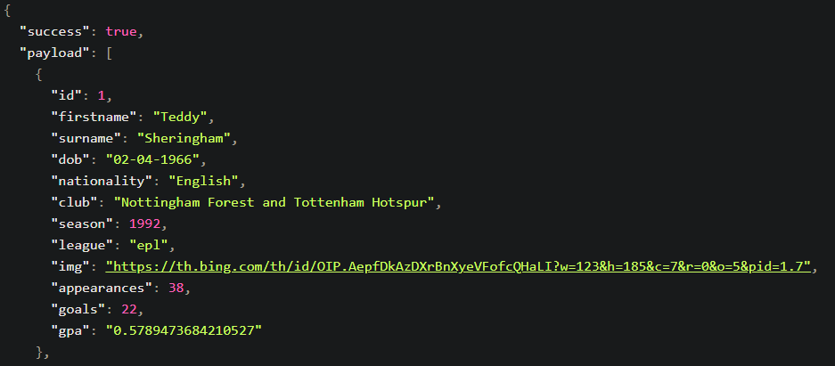

# Top Scorers API

## Author
 Tom Birbeck [GitHub](https://github.com/TomBirbeck) / [LinkedIn](https://www.linkedin.com/in/tom-birbeck)

## About
Top Scorers is an API that currently supplies the top 10 (sometimes more depending on any ties) top scoring player from the English Premier League from the 1992/93 season until present, a long with an image link and other information about the player. I hope to introduce more leagues into the system soon.

## Returned Data
The data return when you send a query should look like this, where the payload is an array of objects.

## Endpoints

To get all the top scorers send a GET request to https://topscorers.herokuapp.com/topscorer

To get the top scorers by year sent a GET request to: https://topscorers.herokuapp.com/topscorer/year/ with the year required added to the end.

To get top scorers by league (currently on supplies epl) send a GET request to  https://topscorers.herokuapp.com/topscorer?league= with the league required at the end. This search is not case sensitive.

To get the top scorers who have scored a certain amount of goals or more send a GET request to https://topscorers.herokuapp.com/topscorer?goals= with the amount of goals added on to the end.

The API does support full C.R.U.D features but the create, update and delete endpoints require authorisation for data management purposes.
